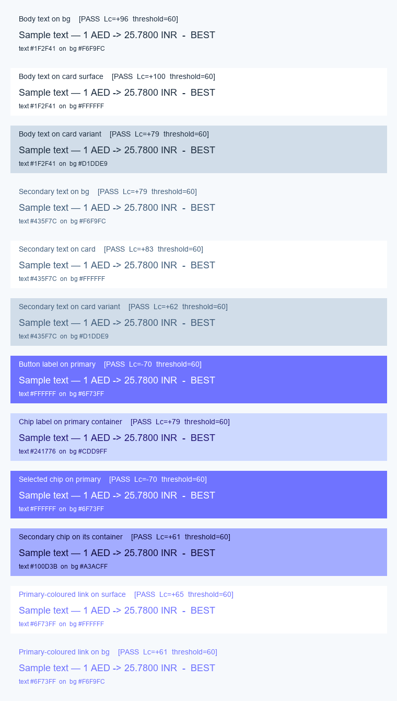
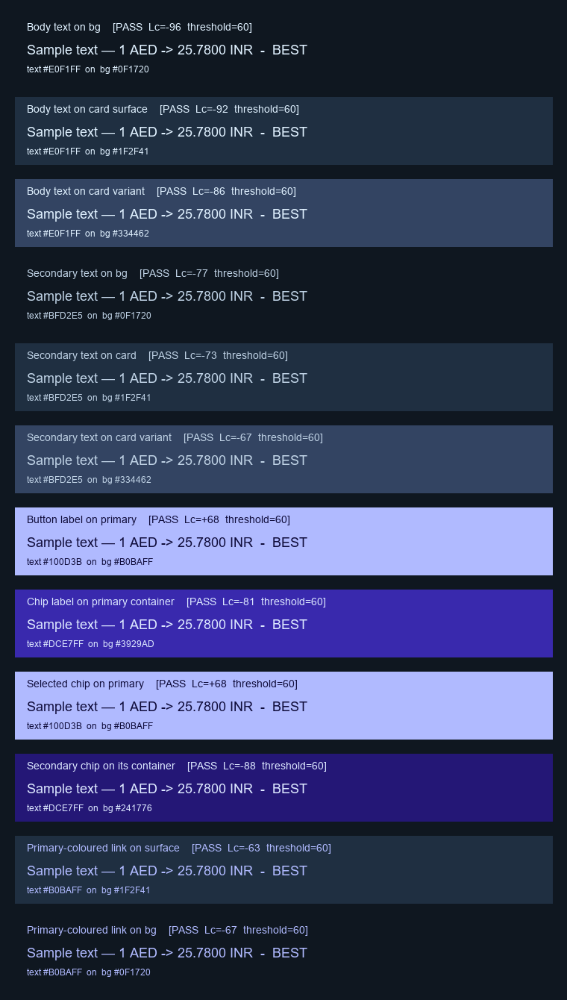

# Colour palette validation
Programmatic APCA contrast scoring + visual swatches for every text-on-background pair the Transfer Rate app renders. Generated by `tools/validate_color_palette.py`.
**APCA thresholds**

| Size class       | min |Lc| |
|------------------|---------|
| Headline (24sp+) | 45      |
| Body (14-18sp)   | 60      |
| Small (10-13sp)  | 75      |

## Light scheme
| Purpose | text | bg | Lc | threshold | result |
|---------|------|----|----|-----------|--------|
| Body text on bg | `#1F2F41` (onSurface) | `#F6F9FC` (background) | +96 | 60 | PASS |
| Body text on card surface | `#1F2F41` (onSurface) | `#FFFFFF` (surface) | +100 | 60 | PASS |
| Body text on card variant | `#1F2F41` (onSurface) | `#D1DDE9` (surfaceVariant) | +79 | 60 | PASS |
| Secondary text on bg | `#435F7C` (onSurfaceVariant) | `#F6F9FC` (background) | +79 | 60 | PASS |
| Secondary text on card | `#435F7C` (onSurfaceVariant) | `#FFFFFF` (surface) | +83 | 60 | PASS |
| Secondary text on card variant | `#435F7C` (onSurfaceVariant) | `#D1DDE9` (surfaceVariant) | +62 | 60 | PASS |
| Button label on primary | `#FFFFFF` (onPrimary) | `#6F73FF` (primary) | -70 | 60 | PASS |
| Chip label on primary container | `#241776` (onPrimaryContainer) | `#CDD9FF` (primaryContainer) | +79 | 60 | PASS |
| Selected chip on primary | `#FFFFFF` (onPrimary) | `#6F73FF` (primary) | -70 | 60 | PASS |
| Secondary chip on its container | `#100D3B` (onSecondaryContainer) | `#A3ACFF` (secondaryContainer) | +61 | 60 | PASS |
| Primary-coloured link on surface | `#6F73FF` (primary) | `#FFFFFF` (surface) | +65 | 60 | PASS |
| Primary-coloured link on bg | `#6F73FF` (primary) | `#F6F9FC` (background) | +61 | 60 | PASS |

## Dark scheme
| Purpose | text | bg | Lc | threshold | result |
|---------|------|----|----|-----------|--------|
| Body text on bg | `#E0F1FF` (onSurface) | `#0F1720` (background) | -96 | 60 | PASS |
| Body text on card surface | `#E0F1FF` (onSurface) | `#1F2F41` (surface) | -92 | 60 | PASS |
| Body text on card variant | `#E0F1FF` (onSurface) | `#334462` (surfaceVariant) | -86 | 60 | PASS |
| Secondary text on bg | `#BFD2E5` (onSurfaceVariant) | `#0F1720` (background) | -77 | 60 | PASS |
| Secondary text on card | `#BFD2E5` (onSurfaceVariant) | `#1F2F41` (surface) | -73 | 60 | PASS |
| Secondary text on card variant | `#BFD2E5` (onSurfaceVariant) | `#334462` (surfaceVariant) | -67 | 60 | PASS |
| Button label on primary | `#100D3B` (onPrimary) | `#B0BAFF` (primary) | +68 | 60 | PASS |
| Chip label on primary container | `#DCE7FF` (onPrimaryContainer) | `#3929AD` (primaryContainer) | -81 | 60 | PASS |
| Selected chip on primary | `#100D3B` (onPrimary) | `#B0BAFF` (primary) | +68 | 60 | PASS |
| Secondary chip on its container | `#DCE7FF` (onSecondaryContainer) | `#241776` (secondaryContainer) | -88 | 60 | PASS |
| Primary-coloured link on surface | `#B0BAFF` (primary) | `#1F2F41` (surface) | -63 | 60 | PASS |
| Primary-coloured link on bg | `#B0BAFF` (primary) | `#0F1720` (background) | -67 | 60 | PASS |

